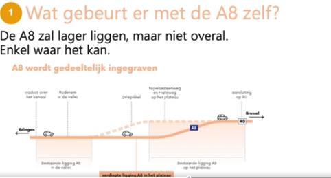
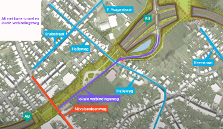

+++
title = 'Update Oktober 2025'
date = 2025-10-01T08:00:00+02:00
draft = false
tags = ['Nieuws']
categories = ['Nieuws']
+++
Beste leden van het actiecomité “voor een betere A8”,

er is heel wat tijd verlopen tussen onze vorige communicatie en dit moment. Maar sedert enige tijd is er opnieuw info gekomen van het project A8. 

We hebben met de stuurgroep enkele keren samengezeten met de Werkvennootschap en stad Halle. Daar konden we onze vragen stellen en de bekommernissen, die jullie tijdens de eerste bijeenkomst uitgebreid hadden geformuleerd, naar hen brengen. 
 
<h2>Waar staan we nu?</h2>

De opmaak van het GRUP is nog steeds volop aan de gang. Dat is een noodzakelijke procedure die heel wat tijd vraagt maar die tegelijk ook de kans geeft om alle varianten en mogelijkheden te onderzoeken en te simuleren. Voor zover we weten zijn er nog geen definitieve keuzes gemaakt. Maar anderzijds zien we toch duidelijke grote lijnen te voorschijn komen. Hierna een overzicht van wat we al weten. 

<h2>Tunnel of overkappingen?</h2>

Wie het project een beetje gevolgd heeft, herinnert zich dat er drie mogelijke scenario’s op tafel lagen: een lange tunnel, een iets kortere tunnel of enkel overkappingen aan de kruispunten. Het ziet er nu naar uit dat de voorkeur van de projectplanners gaat naar de korte tunnel. Die zou beginnen voor de Nijvelsesteenweg en doorlopen tot voorbij de Halleweg. Voorbij deze aansluiting komt de A8 dan opnieuw bovengronds om verder te kunnen aansluiten met de Ring. Deze variant zou de beste kosten/baten verhouding hebben. Hoewel onze voorkeur uitgaat naar een langere tunnel, begrijpen we ook dat er rekening moet gehouden worden met de budgettaire impact. 

<h2>Lokale verbindingsweg Essenbeek</h2>

De grootste bekommernis was hoe het verkeer van Essenbeek zou kunnen aansluiten naar de A8 en de Ring. Met enkel een aansluiting via de Welkomstlaan zouden bewoners van Essenbeek enkel doorheen smalle straten in Sint-Rochus kunnen rijden om op de A8 te komen via de (enige) aansluiting op de Welkomstlaan.  Dit zou zorgen voor veel extra verkeer in Sint-Rochus en grote omrijfactoren voor Essenbeek. Voor ons was dit totaal onaanvaardbaar. 

Na ons aandringen werden aan de drie scenario’s telkens een te onderzoeken variant met een lokale verbindingsweg toegevoegd. Hier ziet het er naar uit dat we een doorbraak hebben kunnen bereiken. Momenteel wordt er een lokale verbindingsweg gepland die parallel loopt met de (getunnelde) A8. Deze lokale verbindingsweg zou starten aan de Nijvelsesteenweg (ongeveer ter hoogte van de bestaande aansluiting) en zou lopen tot de aansluiting met de Welkomstlaan. (2x1 rijvak) Op deze manier zouden de inwoners van Essenbeek en Sint-Rochus via de Nijvelsesteenweg naar de A8 kunnen blijven rijden. Dit zou een grote stap vooruit zijn voor het project en de leefbaarheid van de lokale wijken. 

<h2>Wat met de Halleweg?</h2>

Ook hier liggen de keuzes nog niet vast, maar lijkt zich toch volgend scenario af te tekenen. De Halleweg zou niet meer doorlopen voor gemotoriseerd verkeer, maar wel nog voor fietsers en voetgangers. Het voordeel hiervan is dat Essenbeek eindelijk een veilige verbinding zou krijgen naar Halle, het station en de scholen. Maar we hebben hierbij toch drie belangrijke bekommernissen. 

1.	Inwoners van Essenbeek moeten met de auto dan steeds via de Nijvelsesteenweg naar de A8 en het centrum rijden (via de lokale verbindingsweg). We geloven wel dat de Nijvelsesteenweg, die nu veel wachttijden kent omwille van de lichten met de A8, vlotter zal worden dan nu. Anderzijds moet er berekend worden wat de extra impact zal zijn van het bijkomend verkeer van en naar Essenbeek. We hebben de Werkvennootschap gevraagd of ze dit verder kunnen onderzoeken.
 
2.	Als de Halleweg voor fietsers en voetgangers een veilige verbinding met het centrum moet zijn, moet dat gebeuren zonder conflicten met de lokale verbindingsweg. Anders is deze verbinding alweer niet veilig en weinig bruikbaar. Het beste zou de Halleweg boven de lokale verbindingsweg komen zodat er geen conflicten meer zijn.
 
3.	Als er voor gekozen wordt om de Halleweg niet meer te gebruiken door gemotoriseerd verkeer, vragen we om wel te voorzien dat deze nog gebruikt kan worden door gemotoriseerd verkeer in geval van werken of calamiteiten aan de Nijvelsesteenweg. Essenbeek met slechts 1 verbinding naar het centrum vinden wij een te groot risico als er iets gebeurt.

<h2>Onteigeningen voor een tijdelijke weg</h2>

In de media is al heel wat commotie ontstaan over de vele onteigeningen die er met dit project gepaard zouden gaan. Wat we begrepen hebben is dat er momenteel drie varianten bestudeerd worden voor de tijdelijke weg. Een deel van de onteigeningen zijn nodig om een tijdelijke weg tijdens de werken mogelijk te maken. Een ander deel zijn nodig voor de realisatie van het finaal project. We betreuren uiteraard dat er onteigeningen moeten gebeuren en vragen aan de overheid om een aanvaardbare regeling uit te werken voor alle getroffen eigenaren. 

<h2>Verbinding met Buizingen</h2>

Momenteel zijn zowel de E. Ysayestraat als de Bleukensstraat verbonden met elkaar via de Welkomstlaan. Volgens de huidige plannen zou dat in de toekomst niet langer het geval zijn. Noch de E. Ysayestraat, noch de Bleukensstraat zouden nog verbonden zijn met de Welkomstlaan. Of dit ook voor fietsers het geval gaat zijn is nog niet duidelijk. Het voordeel is dat er een gevaarlijk kruispunt verdwijnt. Anderzijds heeft dit ook een impact op het lokaal verkeer, zowel in dat deel van Sint-Rochus, als voor de inwoners van een deel van Buizingen. We hebben aan de Werkvennootschap en stad Halle gevraagd om dit verder te onderzoeken. 

<h2>Verbinding met Rodenem</h2>

Voor Rodenem wordt een tunnel onder de A8 voorzien ter hoogte van Resteleurs, zowel voor auto’s als voor fietsers en voetgangers. Zij dienen dan via Sint-Rochus naar de Nijvelsesteenweg te rijden om aan te sluiten op de A8 of naar het centrum te rijden. Het zal een omweg zijn voor de inwoners van dit gebied. Anderzijds begrijpen we wel de bestaande aansluiting met de A8 niet kan blijven bestaan en verdwijnt er op deze manier ook een route voor sluipverkeer via Vogelpers en Biezeweide. 

<h2>Lichten of rotondes?</h2>

Het is nog niet bepaald hoe de aansluitingen met de Welkomstlaan/A8 en Nijvelsesteenweg/Lokale Verbindingsweg gaan gebeuren. We merkten dat de voorkeur hier gaat naar slimme verkeerslichten die gestuurd kunnen worden op basis van de verkeersvraag. We hopen dat de gevaarlijke aansluitingen hiermee verdwijnen en vervangen worden door vlotte, conflictvrije en veilige aansluitingen. 

<h2>Conclusies</h2>

We zijn er nog lang niet en proberen alles zo goed mogelijk op te volgen. De komende maanden zal duidelijk worden of het project, waar we nog steeds achter staan, ook voor de inwoners van Sint-Rochus, Essenbeek en Rodenem een meerwaarde zal bieden. We blijven hopen op maximale afbouw van de barrièrewerking, een vlotter verkeer en minder sluipverkeer door de wijken. We moeten beseffen dat het niet voor iedereen een verbetering zal zijn. Maar we zien wel hoopvolle tekenen en wie weet, licht aan het einde van de tunnel. 

De stuurgroep “Actiecomité voor een betere A8”

Heeft u vragen? Opmerkingen? Suggesties?
Zin om aan te sluiten bij de stuurgroep? 
stuur ons een bericht op info@betere-a8.be 